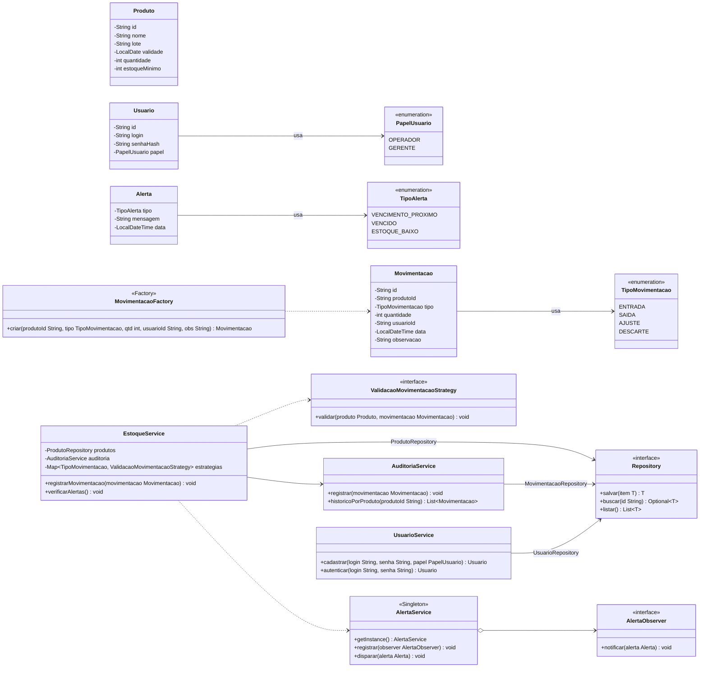

# Diagrama de classes em Mermaid

Conversao do arquivo `docs/diagrama-classes.puml` para Mermaid.

```mermaid
classDiagram
    direction LR

    class TipoMovimentacao {
        <<enumeration>>
        ENTRADA
        SAIDA
        AJUSTE
        DESCARTE
    }

    class PapelUsuario {
        <<enumeration>>
        OPERADOR
        GERENTE
    }

    class TipoAlerta {
        <<enumeration>>
        VENCIMENTO_PROXIMO
        VENCIDO
        ESTOQUE_BAIXO
    }

    class Produto {
        -String id
        -String nome
        -String lote
        -LocalDate validade
        -int quantidade
        -int estoqueMinimo
    }

    class Movimentacao {
        -String id
        -String produtoId
        -TipoMovimentacao tipo
        -int quantidade
        -String usuarioId
        -LocalDateTime data
        -String observacao
    }

    class Usuario {
        -String id
        -String login
        -String senhaHash
        -PapelUsuario papel
    }

    class Alerta {
        -TipoAlerta tipo
        -String mensagem
        -LocalDateTime data
    }

    class Repo["Repository<T>"] {
        <<interface>>
        +salvar(item T) T
        +buscar(id String) Optional~T~
        +listar() List~T~
    }

    class AlertaObserver {
        <<interface>>
        +notificar(alerta Alerta) void
    }

    class ValidacaoMovimentacaoStrategy {
        <<interface>>
        +validar(produto Produto, movimentacao Movimentacao) void
    }

    class AlertaService {
        <<Singleton>>
        +getInstance() AlertaService
        +registrar(observer AlertaObserver) void
        +disparar(alerta Alerta) void
    }

    class MovimentacaoFactory {
        <<Factory>>
        +criar(produtoId String, tipo TipoMovimentacao, qtd int, usuarioId String, obs String) Movimentacao
    }

    class EstoqueService {
        -ProdutoRepository produtos
        -AuditoriaService auditoria
        -Map~TipoMovimentacao, ValidacaoMovimentacaoStrategy~ estrategias
        +registrarMovimentacao(movimentacao Movimentacao) void
        +verificarAlertas() void
    }

    class AuditoriaService {
        +registrar(movimentacao Movimentacao) void
        +historicoPorProduto(produtoId String) List~Movimentacao~
    }

    class UsuarioService {
        +cadastrar(login String, senha String, papel PapelUsuario) Usuario
        +autenticar(login String, senha String) Usuario
    }

    EstoqueService --> Repo : ProdutoRepository
    EstoqueService --> AuditoriaService
    EstoqueService ..> ValidacaoMovimentacaoStrategy
    EstoqueService ..> AlertaService
    AlertaService o--> AlertaObserver
    AuditoriaService --> Repo : MovimentacaoRepository
    UsuarioService --> Repo : UsuarioRepository
    MovimentacaoFactory ..> Movimentacao

    Movimentacao --> TipoMovimentacao : usa
    Usuario --> PapelUsuario : usa
    Alerta --> TipoAlerta : usa
```
